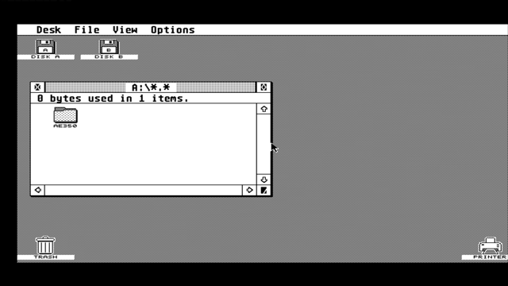

# ST_HELPER: the AE350 RISC-V helper alongside the 030 ST desktop

Build: `gw_sh build_st_helper.tcl` (writes `` `define ST_HELPER `` into
`tang/console138k/build_sel.vh`). Bitstream: `impl/pnr/st_helper.fs`.
Firmware: `helper_fw/mailbox/` (`helper_mailbox.bin`, flash at `0x0600000`).
The desktop build `build_tc138k.tcl` is unchanged: every ST_HELPER change is
inside `` `ifdef ST_HELPER ``. With the define off, synthesis removes it.

**End goal.** The AE350 replaces the BL616 as the core's helper MCU, so that
the FPGA-Companion firmware (keyboard, mouse, OSD, floppy and hard disk
emulation) runs on the AE350 and the BL616 never has to be reflashed. This
first build gives the AE350 the same core-side interface as the BL616 and
tests it. FPGA-Companion itself is not ported yet (see "Port plan" below).

## 1. Boot-then-release of the SPI flash

One SPI NOR holds the core (0x000000), TOS (0x500000) and the helper image
(0x600000). Both the ST and the AE350 need it, but never at the same time:

| Phase | Flash owner | 030 / ST | AE350 | U15 shows |
|---|---|---|---|---|
| power-up | AE350 (in reset) | reset | reset | `STH` |
| DDR3 trained, +20 ms | AE350 | reset | running, boot loader copies `ready`-style image from 0x600000 into DDR3 | `D`, `R`, then the helper's own text |
| firmware writes GPIO[7:0] = 0xA5 ("done with flash"), runs from DDR3 | AE350, CS# idle | reset | running | helper text |
| CS# high for 8 us (or 0xA5 still held after 1 ms, see below): **one-way switch** (`flash_to_st`, sticky) | ST | reset, its flash controller reinitialises | running, flash disconnected (MISO = 1) | |
| +2 us | ST | **released, TOS boots** (EmuTOS 1.4 on David's board) | running, companion link up | |

`st_helper_ctrl.v` is the state machine (clk32). Fallback, so the desktop
always boots: if DDR3 does not train in 4 s (`X`), the firmware does not
signal 0xA5 within 2 s (`T`), 0xA5 goes away again before the switch (`C`),
or S1 is held (`K`), the AE350 is put back into reset, the flash goes to the
ST after 1 ms and the 030 is released; the letter is printed on U15 and BOOT
($FFFB11) says why.

**The SoC's flash CS# never goes idle (hardware, 6 Oct 2026).** The first
cut waited for CS# high and fell back with `C` after 1 ms. On the board the
SoC leaves its flash CS# **asserted (low)** after the boot loader's copy,
even though the CPU then runs from DDR3, and the flash controller's
registers cannot be reached to release it (see section 6). The fabric now
reads that line into the firmware (UART2 RI#, `flash CS# ...: LOW
(asserted)` on U15), and if CS# is still low after 1 ms **while GPIO still
holds 0xA5** the switch is forced: the firmware has said in its own words
that it is done with the flash, and the 030 has not started yet, so no ST
transaction can be cut. BOOT then reads $05 instead of $00. The ST flash
controller is reset after the switch and its 16-ones mode-exit sequence
puts the flash back into a known state, so whatever command the AE350's
controller had left open is abandoned. `C` now only means "0xA5 went away".

**Why this is safe when the 988c846 runtime mux was not.** 988c846 muxed the
flash between ST and AE350 at run time and left an always-driven assign on
`mspi_do` (IO1). The ST flash controller (`tang/console60k/flash_dspi.v`)
reads in dual-I/O mode (0xBB, 100 MHz), so IO0/IO1 must turn around; the
assign fought the flash on every read and TOS never loaded. Here:

- the switch happens **once**, while the 030 is in reset and before the ST
  flash controller has left reset, with both CS# lines high, so no
  transaction is cut and nothing on the ST side ever sees the AE350;
- after the switch IO0/IO1 are real tristate pads driven by the ST
  controller's **own output enables** (`mspi_io_oe`, new ST_HELPER ports on
  `flash_dspi.v`), exactly the desktop's bidirectional behaviour;
- the switch is sticky (no way back until power-off or reconfiguration), so
  the AE350 can never touch the flash again. If its firmware ever tried, it
  would read 0xFF and the ST would not notice.

The flash controller's reset (`flash_reinit`) is released two `flash_clk`
cycles after the switch, so its 16-ones mode-exit sequence runs on the ST's
pads (this also clears any read mode the AE350 boot loader left behind).

## 2. AE350 = the companion MCU (replaces the BL616)

The stock core talks to its helper MCU through `misc/mcu_spi.v`: an SPI slave
(MODE1: SCK idle low, data sampled on the falling edge), plus an active-low
interrupt line from `sysctrl.v`. On the Tang Console the BL616 drives it on
the JTAG dual-purpose pins. In ST_HELPER:

| FPGA-Companion signal | BL616 (desktop) | AE350 (ST_HELPER) |
|---|---|---|
| SS# | `spi_csn` (TMS) | AE350 **GPIO[0]**, held by firmware for a whole message |
| SCK | `spi_sclk` (TCK) | AE350 **GPIO[1]** (bit-banged) |
| MOSI | `spi_dat` (TDI) | AE350 **GPIO[2]** |
| MISO | `spi_dir` (TDO) | UART2 **CTS#** (MSR bit 4 reads the MISO level) |
| IRQ# | `spi_irqn` (U15) | UART2 **DCD#** (MSR bit 7 reads 1 while an IRQ is pending) |
| link up | (n/a) | UART2 **DSR#** (MSR bit 5 reads 1 once the link is wired) |
| (diagnostic) | (n/a) | UART2 **RI#** (MSR bit 6 reads 1 while the SoC's flash CS# is low) |

Why these: the SoC netlist has no free SPI controller and no AHB/APB slave
port towards the fabric (only the Extended AHB master port). The first cut
reused the SoC's flash SPI controller after the handoff, at the Andes map
address 0xF0B00000. On the board that address is not decoded in this SoC
and a read hangs the CPU (the old serial-proof core printed `probing SPI1
@F0B00000` and nothing more); the Gowin BSP's `SPI_BASE` 0xF0F00000 reads
all zeros, so the controller is not reachable at all. The link is therefore
**bit-banged** on GPIO[2:0], which the fabric sees, and MISO comes back on a
UART2 modem-status input, the only fabric-to-CPU path the netlist offers
(GPIO inputs are not readable from the fabric side). IRQ# and "link up" use
DCD# and DSR# the same way. SS# on GPIO[0] means a stray XIP read of
0x80000000 can never reach the core.

`st_helper_mculink.v` re-registers SS#/SCK/MOSI on AHB_CLK (50 MHz) and only
passes a level after two equal samples, so a glitch can never clock
`mcu_spi`. The firmware waits 8 MSR reads per half bit (a few hundred kHz
SCK). That is plenty for status and settings; the BL616 runs this link at
13.3 MHz, and floppy/HDD sector traffic over it (port plan) will want a
faster path later.

**The BL616 is kept off the link.** Its SS#/SCK/MOSI inputs (and a PMOD
companion's) are ignored, its MISO pin `spi_dir` is tristated and its IRQ pin
(C22 in this build) is held inactive high, so it cannot fight the AE350. The
stock BL616 firmware still does what it does today: USB serial bridge on U15,
and JTAG for programming. It is never reflashed.

The link test in the firmware sends the FPGA-Companion
`sys_status_is_valid()` frame byte for byte (target 0, command 0) and
expects `5C 42`, as the BL616 does at start-up. Only read-only commands are
sent: the core's coldboot IRQ is reported, not acknowledged.

## 3. Mailbox: the ST talks to the helper

A 32-byte register block at **$FFFB00-$FFFB1F** (`st_helper_mailbox.v`,
decoded in `atarist.v`). Supervisor data accesses only, like all ST I/O; A23:5
decoded, so it also appears at $FFFFFB00 through the 030's 24-bit mirror.
Bytes on odd addresses (D7:0), like the MFP; a word read returns $FF in D15:8.

| Address | Name | R/W | Meaning |
|---|---|---|---|
| $FFFB01 | ID | R | `H` ($48) |
| $FFFB03 | VER | R | $01 |
| $FFFB05 | STATUS | R | b0 TXRDY, b1 RXAVL, b2 HELPER_UP, b3 HELPER_FAIL, b4 RXOVR (sticky), b5 TXIDLE, b6 RXFERR (sticky) |
| $FFFB07 | TXDATA | W | send one byte to the helper (dropped if TX is full) |
| $FFFB07 | TXFREE | R | free TX FIFO slots (0-16) |
| $FFFB09 | RXDATA | R | next byte from the helper, removed at the end of the read; $00 if empty |
| $FFFB0B | RXCOUNT | R | bytes waiting (saturates at 255) |
| $FFFB0D | CTRL | W | b0 flush RX, b1 clear RXOVR/RXFERR, b2 flush TX |
| $FFFB0F | HGPIO | R | AE350 GPIO[7:0] ($A5 after the handoff; bit 0 is the companion SS#) |
| $FFFB11 | BOOT | R | $00 helper up, $05 helper up with the switch forced (CS# stuck low, normal on this SoC), $01 DDR3 timeout, $02 no flash-done, $03 S1 skip, $04 0xA5 withdrawn |
| $FFFB13-$FFFB1F | SCRATCH0-6 | R/W | scratch bytes for a bus test |

**Why $FFFB00.** It is unused on ST, STE, Mega STE, TT and Falcon (hardware
register listing v9.1: between TT MFP2 at $FFFA81-$FFFAAF and the ACIAs at
$FFFC00). The GSTMCU does not decode it (VPA covers $FFFC00-$FFFDFF), so before
this device an access there ended in the bus-error timeout. $FF9000 (STE
GAMECART) and $FFFE00 (MonSTer) were avoided. TOS 2.06 is not known to probe
$FFFBxx; this has not been tested on hardware.

**Transport.** The mailbox talks to the helper's UART2 inside the FPGA: TX
FIFO (16) -> 115200 8N1 -> UART2_RXD; UART2_TXD -> RX FIFO (256, block RAM).
UART2_TXD also goes to U15, so everything the helper says appears on David's
terminal too. Everything is in clk32; the only asynchronous input is
UART2_TXD (2-flop synchroniser). No interrupts yet (the ST polls); an MFP or
level-6 interrupt is possible future work.

For the end goal the mailbox is a debug console, not the companion path:
FPGA-Companion reaches the ST through the normal core targets (IKBD, FDC,
ACSI/SD) over the SPI link above.

## 4. U15, V14 and C22

U15 is the FPGA-to-BL616 UART line; the stock BL616 bridges it to its USB
serial port (115200 8N1). In ST_HELPER, U15 carries the fabric boot letters
while the AE350 is in reset and the AE350's UART2 afterwards, as in the
serial proof. `spi_irqn` moves to C22 (held high, see above). Only the pin
file differs from the desktop: `tang/console138k/atarist_st_helper.cst`.

The other direction, PC -> BL616 -> FPGA, is ball V14 (`uart_rx` in the CST
comments; in this design the input is called `bl616_jtagsel` and idles high
with a pull-up). ST_HELPER ANDs it into UART2 RX next to the mailbox, so
typing in the same PC terminal talks to the helper directly (expected from
the CST's "internal BL616 UART" note; not yet tested). Typing on the PC while
the ST sends garbles both; the firmware drops bytes with framing errors and
NULs, so an idle-low V14 cannot flood it.

## 4a. Getting test code onto the ST in this build

The ST normally gets its floppy and hard disk images, and its USB keyboard
and mouse, from FPGA-Companion on the BL616. The stock BL616 firmware on this
board does not do that (it never did in the desktop build either), and the
AE350 port of FPGA-Companion does not exist yet. So there is no disk and no
keyboard to start `MBXTERM.PRG` from. Three ways, simplest first:

1. **U15 + V14 only (no ST program).** The helper's boot text, including the
   companion-link test (`core status: 5C 42 ... link OK`), appears on U15 by
   itself. Typing in the PC terminal reaches the helper (V14), so `s`, `i`
   and echo lines work from the PC. This tests the flash handoff, the AE350
   and the AE350-to-core link. It does not test the ST side of the mailbox.
2. **Self-test cartridge (build option `ST_HELPER_CART`, on in
   `build_st_helper.tcl`).** A 644-byte cartridge ROM at $FA0000 is built
   into the bitstream (`st_helper_cart_rom.v`, one block RAM, contents
   `st_helper_cart.hex` generated from `helper_fw/st_test/mbxcart.s`). The GSTMCU already decodes ROM4 and
   acknowledges it like the TOS ROM; the core only supplies the data. TOS 2.06
   finds the cartridge magic at boot and calls it once (CA_INIT bit 3, after
   GEMDOS, before the boot disk). It prints BOOT and STATUS on the ST screen,
   sends `hello from the ST` to the helper, shows the helper's answer
   (`helper: got 17 bytes: HELLO FROM THE ST`) for a few seconds and returns,
   so TOS carries on to the desktop. The helper prints the same exchange on
   U15. No disk, keyboard or flash write needed. **U15 alone is enough for
   the first test:** with just the U15 output in a terminal (V14 not used),
   David sees the boot letters, the link test and the cartridge exchange,
   and the ST screen shows the ST side. If the helper is not
   running it prints one line and returns at once. Remove the
   `ST_HELPER_CART` line in `build_st_helper.tcl` to build without it.
3. **Later, `MBXTERM.PRG` from a floppy image on the SD card**, once the
   AE350 runs the FPGA-Companion SD/floppy code (section 7, steps 2-3; no USB
   needed for that part). `helper_fw/st_test/build.sh` also makes
   `MBXTERM.ST`, a 720 KB FAT12 floppy image with `MBXTERM.PRG` in its root
   (`mkst.py`). Copy it to the SD card, mount it as drive A: from the
   companion, and start it from the desktop. Typing into it needs the
   keyboard (section 7, step 4). It also works today on any setup with a
   working companion.

A cartridge ROM loaded from SPI flash was considered and not chosen: it would
change the TOS ROM read path in `flash_dspi.v`, which is the part of this
build that must not break. A tiny floppy image served by the AE350 from
SPI flash was also considered: in this core the floppy and ACSI sector data
always comes from the SD card through `misc/sd_card.v` (the companion only
translates the sector numbers), so serving it from flash would need new
HDL. The SD card route (item 3) needs no HDL change.

## 5. What to expect

U15, 115200 8N1:

Recorded on the board, 6 Oct 2026 (core 194197d, firmware v4):

```
STH
DR
AE350 helper mailbox v4 (running from DDR3)
flash SPI @F0F00000: IDREV 00000000 (0 = registers not reachable; link is bit-banged)
flash CS# before 0xA5: LOW (asserted)
0xA5 sent, flash handed to the ST
link: fabric says up (BOOT 0 or 5), MSR E0
flash CS# after handoff: LOW (asserted)
core status: 5C 42 id=00 cb=00 -> link OK
core IRQ# asserted (pending, not acked by this test)
commands: s = core status over the companion SPI link, i = core IRQ line, w = reset the ST, c = cold-boot the ST, ? = this; other lines are echoed in upper case
> hello from the T
helper: got 16 bytes: HELLO FROM THE T
>
```

Fallback: the helper text stops and a `X`, `T`, `C` or `K` line follows; the
desktop still boots. A cut-off line followed by a letter (`AE350 hel?C`) is
the fallback resetting the AE350 mid-character: U15 goes back to the fabric,
which prints the letter. That is what the first cut (ae4b41a) showed: `C`
1 ms after 0xA5, because CS# never went idle.

`w` and `c` reset the ST through sysctrl `R` (1 = reset, 3 = cold boot with
RAM scramble, then 0), the same values the FPGA-Companion OSD actions use.

ST screen (with `ST_HELPER_CART`), during the TOS boot, before the desktop:

```
ST_HELPER mailbox self-test (cartridge $FA0000)
BOOT $05  STATUS $27            ($00 if CS# went idle; $25 if no helper bytes are waiting)
sent 'hello from the ST', helper says:
hello from the ST
helper: got 17 bytes: HELLO FROM THE ST
>
-- mailbox test done, TOS continues --
```

From the PC terminal (V14), type `s` and RETURN to rerun the link test.

ST side, once a disk path exists: run `MBXTERM.PRG` (`helper_fw/st_test/`). It prints VER, BOOT,
STATUS and HGPIO, then everything typed goes to the helper and its replies
are shown. Type `hello` and RETURN: `helper: got 5 bytes: HELLO`. Type `s`
and RETURN: the helper runs the companion status frame again and shows the
result. ESC quits.

Without the program, from a monitor in supervisor mode (e.g. TEMPLMON,
MonST): read $FFFB01 (should be $48), $FFFB11 (should be $00), $FFFB05
(bit 2 set); write $41 to $FFFB07 and then $0D; read $FFFB0B (count) and
$FFFB09 repeatedly to get `A`, CR, LF and the reply.

## 6. Risks

- The flash SCK pad now goes through a LUT mux in ST_HELPER (AE350 or the PLL
  clock). This shifts the 100 MHz dual-I/O read timing slightly against the
  desktop build. If TOS does not load in this build but does with the
  desktop build, suspect this first.
- Dual-purpose pin options are the desktop's (JTAG, SSPI, READY, DONE, MSPI
  and CPU as GPIO), not the serial proof's (MSPI + CPU only). If the AE350
  does not boot, the fallback still starts the desktop.
- Boot delay: about 25 ms with the helper, up to about 6 s (DDR3 timeout +
  handshake timeout) if it is missing; S1 at power-up skips it.
- S0 resets only the ST in this build; DDR3 and the helper keep running.
- `ST_HELPER_CART` makes TOS find a cartridge. The self-test returns within
  a few seconds whatever happens on the helper side (all loops have
  budgets), but a cartridge that hung would stop the boot: remove the define
  if the boot stops after its title line.
- The SoC's flash SPI controller is not reachable from the CPU in this SoC
  (0xF0B00000 hangs the bus, 0xF0F00000 reads zeros), so the firmware must not
  touch either address; v4 reads only the zero ID at 0xF0F00000 as a report.
- Forced switch (BOOT $05): the AE350's flash controller may still think a
  command is open. It can no longer reach the pads (MISO reads 1, CS#/SCK go
  to the ST), and the firmware runs from DDR3, so this only matters if a
  future firmware reads flash after 0xA5. Do not.

## 5a. Hardware results, 6 Oct 2026

- Core 194197d + firmware v4: handoff forced (BOOT $05), link OK (`5C 42`),
  cartridge exchange shown on the ST screen and on U15, `s`/`w`/`c` typed on
  the PC over V14 work.
- One byte of the cartridge's first line is lost at power-up on both v3 and
  v4 (`hello from the T`, `hello from theST`); after a `w` or `c` reset all
  17 bytes arrive. The mailbox simulation loses nothing. Not solved yet;
  likely the helper's RX at the moment the 030 starts (RXOVR or framing
  state from the handoff), not the ST side.
- The TOS slot at 0x500000 holds **EmuTOS 1.4** on this board, not TOS 2.06.
- After a `w` (warm reset, R=1) EmuTOS printed the cartridge exchange and then
  `System halted!`. After a `c` (cold boot, R=3) in the same session it
  reached the GEM desktop. Two flash-triggered boots also halted, and David's
  first boot reached the desktop. A reconfiguration leaves SDRAM contents in
  place (ram_scramble restarts at 0), so EmuTOS sees valid warm-boot RAM, and
  the BL616 companion's start-up only holds R=1 and never cold-boots, so a
  plain desktop build sees the same RAM state. Whether the halt comes from the
  cartridge or from a warm boot in general has not been separated yet; a
  build without `ST_HELPER_CART`, warm-reset with `w`, will tell.

## 7. Port plan: the whole BL616 helper on the AE350

On MiSTeryNano the BL616 runs FPGA-Companion (Till Harbaum, Apache-2.0):
USB host for keyboard, mouse and joysticks, the OSD menu, and SD card
access with FAT, image mounting and sector translation for floppy and ACSI.
It talks to the core only through `mcu_spi` (targets SYS, HID, OSD, SDC)
and the IRQ line. This build already gives the AE350 that link, so the port
is mostly firmware. The hardware stays as it is in this build unless noted.

1. **Link layer (`src/ae350/mcu_hw.c`).** `mcu_hw_spi_begin/tx_u08/end` are
   the three functions in `helper_fw/mailbox/mailbox.c` (GPIO[0] low, one
   ATCSPI200 write-and-read byte, GPIO[0] high). Add multi-byte transfers
   (FIFO bursts) for sector data. The IRQ is the UART2 modem-status
   interrupt on DCD (MSR bit 3 delta, bit 7 level) in place of the BL616
   GPIO interrupt; `mcu_hw_irq_ack` re-arms it. Raise SCK from ~1.6 MHz once
   the MISO margin is measured. With the AHB-clock retiming in
   `st_helper_mculink.v` the link passed simulation up to 6.25 MHz
   (80 ns half-period).
2. **OS and core status.** FreeRTOS from the Andes AE350 SDK (FPGA-Companion
   already uses FreeRTOS on the BL616), or a bare-metal main loop first.
   `sys_status_is_valid` already works (the link test). Then the SYS target:
   core id, DIP/config bits, reset control.
3. **SD card, floppy and ACSI.** No new HDL or driver. The SD card is wired
   to the core (`misc/sd_card.v`, pins V15/Y16/AA15...). FPGA-Companion's
   `sdc.c` + FatFs read the card through the SDC target (the core has a
   512-byte MCU buffer). On a core request (`sdc_int` -> IRQ) the companion
   translates the image sector to an SD sector, and the core reads it
   straight into its own buffer. So the sector data never crosses the slow
   link, only FAT and directory reads do (about 3 ms per 512 bytes at the
   current SCK). `sdc.c`, `ff.c` and the image/mount code are portable C.
   This step alone makes floppy images (and `MBXTERM.ST`) usable.
4. **USB keyboard and mouse: reuse `usb_hid_host.v` from 168ktest/Hybrid030.**
   The AE350 has no USB host, but the fabric can be one. nand2mario's
   `usb_hid_host.v` (low-speed HID boot protocol, 12 MHz clock) is already
   in `/workspace/ae350_old_bringup/168ktest/src/` and
   `Hybrid030/hybrid_falcon030/src/` with its `usb_hid_host_rom.hex` and
   `gowin_pll_usb`. It runs on the Console's two USB-A host ports (USB1 D+/D-
   = H13/G13, USB2 = M15/M16, pins from the NESTang Console port). These
   pins are free in the Atarist CST. Two ways to wire it, both behind a new
   `ST_HELPER_USB` define:
   - **4a. Through the AE350 (the companion way, needed for the OSD).** Each
     `usb_hid_host` instance feeds a small register block that the AE350
     reads: `typ`, a report counter, `key_modifiers`, `key1..4`, mouse
     buttons/dx/dy. Hybrid030's `falcon_hid_ahb.v` already writes these
     events into a DDR3 ring through the AE350's Extended AHB Master port
     and can be reused. A smaller choice is an APB/GPIO-style read port.
     The firmware replaces the BL616 USB host glue (under `src/bl616/`)
     with a reader for these reports. It rebuilds an 8-byte boot-protocol
     report from the registers and hands it to the existing `hid.c`
     (`kbd_parse`/`mouse_parse`). That code
     diffs the reports into key make/break codes and mouse movement and
     sends them on the HID target, which `misc/hid.v` turns into IKBD events
     (keyboard command 1, mouse 2, joystick 3). The OSD hotkey and menu work
     because the MCU sees every key.
   - **4b. Fabric-only shortcut (no firmware).** A `hid_inject.v` diffs the
     `usb_hid_host` reports and drives `hid.v` with the same byte frames
     the MCU would send, muxed with the `mcu_spi` HID strobe. This gives
     keyboard and mouse on the ST before the firmware port (and makes
     `MBXTERM` usable), but no OSD hotkey. It is a stepping stone only.
   - **Clocks:** this build uses all 8 primary clocks (100%). The 12 MHz USB
     clock must come from a spare output of an existing PLL on a non-primary
     (long-wire) route, or a clock net must be freed. Check this first.
     Joysticks: `usb_hid_host` also decodes gamepads (`typ` = 3).
5. **OSD.** The core build has `osd_data_out = 8'h55` (no OSD in the 030
   core yet). MiSTeryNano's `misc/osd_u8g2.v` is already in the tree but not
   instantiated; wire it into the video path, or keep the menu on the
   helper's UART console at first. FPGA-Companion's menu code (`menu.c`,
   u8g2) is portable.
6. **BL616 for good.** Once steps 1-4 work, the BL616 is only the USB-serial
   bridge and JTAG for U15/V14 and programming. Its SPI pins stay tristated
   and ignored (section 2). Keep the mailbox as a debug channel or drop it.
7. **Order, simplest first:** 1+2 (link, already half done), 3 (SD
   floppy: run `MBXTERM.ST`), 4b (keys on the ST), 4a (keys through the
   companion), 5 (OSD).

## 7a. Port status, 6 Oct 2026: steps 1-3 run on the board

The FPGA-Companion sources (`helper_fw/fpga-companion`, upstream `0e5e590`,
Till Harbaum) run unchanged on the AE350. Only a new `src/ae350/` platform
directory was added, next to `bl616/` and `rp2040/`. There is no new HDL; the
core is `build_st_helper.tcl` at `e2297e8`, with TNS 0 on every clock.

- **Platform (`src/ae350/`).** `mcu_hw.c` provides the link and the IRQ. The
  link is bit-banged SPI mode 1 on GPIO0/1/2 with MISO on UART2 CTS (the
  ATCSPI200 registers cannot be reached, section 5a). The core IRQ is the
  polled DCD level. `mcu_hw.c` also does the flash handoff (0xA5), the time
  base, the heap, and stubs for USB. `main.c` holds the start-up and the main
  loop. `console.c` is the COM4 command line. `stubs.c` covers the menu, OSD
  and HID until steps 4/5. `rtos_shim/` has FreeRTOS API stubs, so `sdc.c`
  and `sysctrl.c` build unchanged. `ffconf.h` sets CP437 and no float.
  Build with `helper_fw/companion/build_companion.bat` (AndeSight gcc,
  laptop). `check_box.sh` is a compile/link check with Debian gcc + picolibc.
- **Bare metal, not FreeRTOS (yet).** One main loop polls the IRQ and the
  console. Nothing in steps 1-3 needs threads, and with no scheduler the
  fixed-latency SPI bit-banging can never be preempted. FreeRTOS (Andes SDK
  port) comes in with USB HID/OSD, when the menu, HID and SD tasks of the
  BL616 port need to run in parallel. The shim keeps the source compatible
  either way.
- **Start-up.** Calibrate the time base against the UART. Send 0xA5 (the
  flash goes to the ST). Wait for DSR (link up). Run `sys_wait4fpga`.
  `sdc_init`. Load the core XML (via the SD, otherwise the core's own gzip'd
  `atarist.xml` over `SPI_SYS_READ_CFG`). Run the `init` action. One
  difference from the BL616: R (reset) is left alone, because the ST is
  already running. Then `/sd/atarist.ini` is read and the default images are
  mounted.
- **Link.** The default is `spd 2`. The `xml 20` test passed 20/20 at spd 8,
  4, 2 and 1 (the XML read takes 63 ms at spd 8 and 22 ms at spd 1). Floppy
  sectors do not cross the link: `sdc.c` sends the core a cluster link table
  (or direct mapping for contiguous files), and `sd_card.v` reads the card
  itself.
- **SD card.** An 8 GB FAT32 card (SDHCv2) in the Console's TF slot works
  through `misc/sd_card.v` (status 8c). On the card are `blank.st` (720 KB)
  and `atarist.ini`, which `save` writes. Images go in the root or in
  folders. Floppies are raw `.st`; MSA is not supported by FPGA-Companion
  either, so convert it first (e.g. Hatari `hmsa`). ACSI hard disks are
  `.hd`/`.img` (`mount h0 ...`).
- **Results on the board (flash, location 417).** Port1b: `ls` lists the card
  and `mount a blank.st` works. On the desktop, Alt+A (sent with
  `key alt+a`) opens `A:\*.*` with "0 bytes used in 0 items". File > New
  Folder made an `AE350` folder; the ST wrote it into the image on the SD
  card, and it is still there after a cold boot (`c`). `save` wrote
  `atarist.ini`. Port1c (spd 2): from power-up the helper reads
  `atarist.ini` and mounts `blank.st` as A: before TOS starts. The desktop
  shows the `AE350` folder. 
- **COM4 commands:** `s i w c` as v4, plus `sd [init]`, `ls [dir]`,
  `mount a|b|h0|h1 <file>`, `eject`, `save`, `cfg`, `xml [n]`, `spd [n]`,
  `key <k>...` (e.g. `key alt+a`, `key ctrl+n`), `type <text>`,
  `mouse dx dy`, `click [2]`. The key and mouse commands send the same HID
  target frames that `hid.c` will send in step 4. Other lines are still
  echoed for the mailbox cartridge.
- **Known gaps.** `var X=N` settings from the ini are stored but not yet
  applied to the core. MCU reset (`mcu_hw_reset`) is ignored, because the
  image cannot be reloaded after the handoff. `mcycle` gives about 797k/ms
  and PLMT mtime runs at ~50 MHz (not 32768 Hz); the ticks are calibrated
  against the UART, so timeouts are right.
- **Next.** Step 4: `usb_hid_host.v` + a register block read by the AE350,
  feeding `hid.c`. The 12 MHz clock route has to be checked first (section 7,
  step 4). Then FreeRTOS. Step 5: `osd_u8g2.v` in the video path, plus
  `menu.c`/u8g2.

## 7b. Step 4: USB keyboard and mouse (ST_HELPER_USB), 6 Oct 2026

Built, timing-clean and flashed. The SD and floppy features still work with it.
Not yet tested with a real keyboard or mouse, because nothing was plugged in
overnight.

- **No 12 MHz clock net.** This build has no free PRIMARY or LW clock
  resources (8/8 each). So `usb_hid_host` (nand2mario, copied from 168ktest,
  same as Hybrid030) got a `usbce` clock enable on its three always blocks
  and its ROM. It runs on `clk32` with a 3-of-8 enable, which is exactly
  12 MHz on average. Edges land on a 31 ns grid. The receiver re-syncs on
  every D- edge and samples mid-bit, so the jitter is well inside what
  low-speed devices accept. There is no new PLL output and no clock domain
  crossing (the reports are in the `mcu_spi` domain).
- **Fabric (`tang/console138k/st_helper_usb.v`, behind ``ST_HELPER_USB`` in
  `build_st_helper.tcl` only).** Two cores, one per USB-A port: usb1 is
  H13/G13 and usb2 is M15/M16. The pins and settings come from nand2mario's
  NESTang `src/boards/console.cst`, where "usb1 is on the left". Each port
  latches the device type, a report counter, the keyboard modifiers and
  keys 1-4, and the mouse buttons with dx/dy summed since the last read.
  Reading clears the sum. The AE350 reads this on the existing companion
  link with HID command 0x40 (frame in the file header). `misterynano.sv`
  muxes it onto `hid_data_out` only for that command; `hid.v` is unchanged.
  Commit `6942ad4`. Timing: TNS 0 on every clock. 29% logic, BSRAM 163/340.
- **Firmware (`src/ae350/usb.c`).** The main loop reads both ports every
  4 ms. A new report becomes the boot-protocol packet (8-byte keyboard,
  3-byte mouse) and goes to FPGA-Companion's unchanged `hid.c`
  (`kbd_parse`, `mouse_parse`) and `ps2helper.c`. Those send the HID target
  frames, which `hid.v` turns into IKBD events, exactly as on the BL616. When
  a keyboard is unplugged, all its keys are released. The F12 OSD hotkey is
  already filtered by `kbd_parse` (the menu is a stub until step 5).
  `usb_init` checks for the 0x5A reply, so the same firmware also runs on a
  core without USB. COM4 `usb` shows both ports. Commit `4d13c84`.
- **What to use:** either USB-A port on the Console. Only low-speed HID
  boot-protocol devices work (most plain wired keyboards and mice). No hubs.
  Full-speed devices (many gaming, wireless and combo receivers) are not
  supported by `usb_hid_host`. Gamepads are detected (typ 3) but not yet
  forwarded.
- **On the board:** after power-up, `USB: fabric USB host found
  (ST_HELPER_USB), polling both USB-A ports`. `usb` shows both ports `none`
  with nothing plugged in, and 83k polls without an error. The core link,
  `xml 20` (20/20 OK), atarist.ini automount of A: and the desktop A: window
  are all as in 7a.
- **To test:** plug a keyboard into one port and a mouse into the other. COM4
  should print `USB port 1: keyboard` / `USB port 2: mouse`. Type in a
  desktop dialog (File > New Folder) and move the pointer. If a port stays
  `none`, the device is probably full-speed; try another one.
- **Step 5 (OSD) findings.** `osd_u8g2` is already instantiated in
  `tang/nano20k/video.v`, but only on the LCD path. HDMI shows the raw ST
  video through `hdmi_tp`'s frame buffer (top.sv: "raw ST video (no OSD)").
  The OSD therefore needs `osd_u8g2` in front of that frame buffer (or on
  its output), with `osd_data_out` wired. The firmware side needs
  FPGA-Companion's `osd_u8g2.c` and `menu.c`, plus the u8g2 library (not in
  `src/`, it comes from the BL616 SDK), most likely with FreeRTOS for the
  menu task. Not started.

## 7c. Colour monitor (`ST_COLOUR_MONITOR`), 7 Oct 2026

- Commit 869d445 forced ST High by tying `mono_detect` low. With
  `ST_COLOUR_MONITOR` (set in `build_st_helper.tcl` only), `misterynano.sv`
  ties it high instead, so the ST sees a colour monitor. The setting is fixed
  at build time. It does not follow `system_video` or the ini `var`
  settings, because the helper does not apply those to the core yet.
- `st_framebuffer.v` already handles colour: 240 lines x 640 samples,
  line-doubled to 480. A low res pixel is 2 samples and a medium res pixel 1
  sample. With `H_OFS_COLOR` = 96 medium res loses its leftmost 2 pixels,
  which is not visible on the desktop. The mode is detected per frame from
  the hsync period, so no setting is needed. The DIAG overlay is not in this
  build (`DIAG_EN` 0).
- On the board (`st_helper_colour_30e5fe5.fs`, TNS 0, helper usb1
  unchanged), after `c`: the EmuTOS desktop came up in colour low res
  (green). Alt+A showed A: with GEMBENCH's files. Options > Change
  resolution switched to medium res, which displayed correctly. The USB mouse
  showed up on port 1. The keyboard did not enumerate on port 2 after the
  reflash (`usb`: none); replug it.

## 7d. Step 5: the OSD menu (`ST_HELPER_OSD`), 7 Oct 2026

What runs:

- **Core:** `tang/console138k/st_helper_osd.v` is built from `misc/osd_u8g2.v`. It
  takes the same OSD-target SPI commands (1 = show/hide, 2 = tile data) and
  has a 1 KB buffer. It sits on the raw ST video (clk32) in front of
  `st_framebuffer`, so it shows on HDMI. Each frame it measures the DE
  window and centres the OSD in it:
  - Colour: 8 clk32 x 2 lines per OSD pixel.
  - Mono: 4 x 4.
  - Either way it is 512x256 on the 640x480 HDMI output.
- **Build switch:** behind `ST_HELPER_OSD` in `build_st_helper.tcl`. The
  desktop tcl is unchanged, and video.v's osd_u8g2 stays on the LCD path.
- **Firmware:** the companion runs the unchanged FPGA-Companion `menu.c` and
  `osd_u8g2.c` with olikraus/u8g2 at dc9fc73, the pin from the FPGA-Companion
  submodule. `src/u8g2/` is a subset with its BSD-2-Clause LICENSE; see
  `README.FalconFPGA`.
- **FreeRTOS stand-in:** FreeRTOS is replaced by a small cooperative shim
  (`src/ae350/rtos_shim/coop.c`): one menu task, software timers and queues.
- **Start-up:** the original order runs: XML `init` (R=1), atarist.ini, mount
  the defaults, then `ready` (R=0).
- **Hotkey:** F12 opens the menu and Shift+F12 opens the system menu. This is
  the ini HOTKEY default, through hid.c.
- **COM console:** `osd toggle|up|down|left|right|select|back|pgup|pgdn|system`
  drives the menu the same way.
- **Mounting:** choosing a file in "Disk A:" mounts it through sdc.c. The
  `mount`, `ls`, `sd` and `usb` console commands still work.

Board test, 7 Oct 2026 (core 1f7f519, firmware helper_companion_osd1.bin):

- `osd toggle` showed the menu (Disk A:, System, Storage, Settings) over
  the GEM desktop in medium res.
- `select` opened the file list (No Disk, blank.st).
- `select` mounted /sd/blank.st on A:.
- `toggle` closed the menu. The A: window then listed the disk.

Known issue: the OSD sits a few pixels left of centre.

### 7e. SD upload over COM4 (firmware osd2), 7 Oct 2026

The firmware has new console commands `put <file>`, `h <hex>` and `pend`.
`helper_fw/tools/sd_upload.ps1` uses them to write a file to /sd.

- **Speed:** about 3.3 KB/s.
- **Not working yet:** writes fail with "SDC: write timeout on sector N"
  after anywhere between 0 and 390 KB. The core's `sd_card.v` then sticks in
  card state 13, and only reloading the core clears it.
- **Workaround:** until the write path is fixed, copy images to the card on
  a PC.
- **Fixed in source, not yet flashed:** the `h0` (64 zero bytes) shortcut
  was broken in osd2.


- Gowin RiscV_AE350_SOC BSP (`ae350.h`, Gowin Semiconductor / Andes): the
  peripheral map used by the firmware (UART2 0xF0300000, GPIO 0xF0700000).
- Boot handoff and AE350 wiring follow the working AE350 bring-up in
  `Hybrid030` / 168ktest (DDR3 reset timing, flash ball map, boot loader).
- MiSTeryNano and FPGA-Companion: Till Harbaum and the MiSTle-Dev
  contributors. The link protocol, `misc/mcu_spi.v` and `misc/sysctrl.v` are
  theirs (FPGA-Companion is Apache-2.0, `helper_fw/fpga-companion/LICENSE`;
  the HDL files carry their own headers).
- `usb_hid_host.v` (port plan, step 4; not in this build): nand2mario,
  based on work by hi631, https://github.com/nand2mario/usb_hid_host, as
  used in 168ktest/Hybrid030.
- The 030 bridge credits Stephen J. Leary's TerribleFire TF534 (see the
  README).

## 7f. STE chipset (`ST_STE`), 7 Oct 2026

- `misterynano.sv`: under `ST_STE` the core uses `core_chipset = 2` for
  `.ste` and `.blitter_en` (OSD chipset ignored) and `rom_ste_bit = 0`, so TOS
  is still read from the ST slot (flash 0x500000, TOS 2.06 UK). Without the
  define nothing changes. Extra RAM is still `system_memory` (OSD), not `ste`.
- The helper SD `WRITE_FIX` is now behind `ST_SD_WRITE_FIX` (off): it broke
  timing (see 7e).
- Build 784effc: timing clean (clk_cpu030 16.010 MHz, TNS 0). Flashed as
  `st_helper_ste_784effc.fs`; TOS 2.06 boots to the colour desktop. TOS 2.06 on
  a 68030 shows Options > Cache (not Blitter), so that menu does not prove the
  blitter. _MCH cookie, DMA sound and joypads not yet verified.
